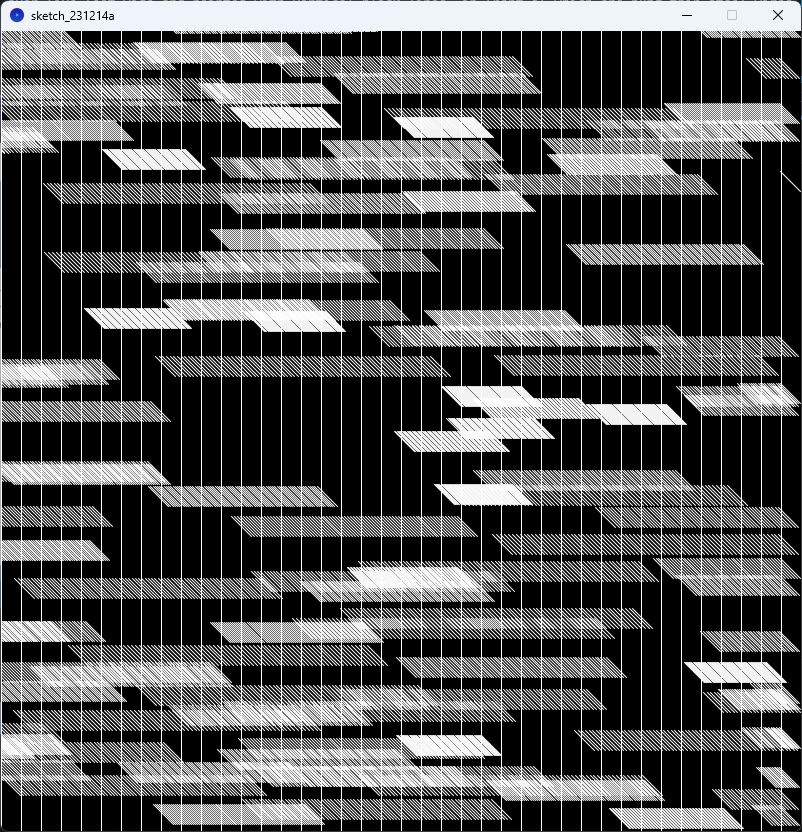
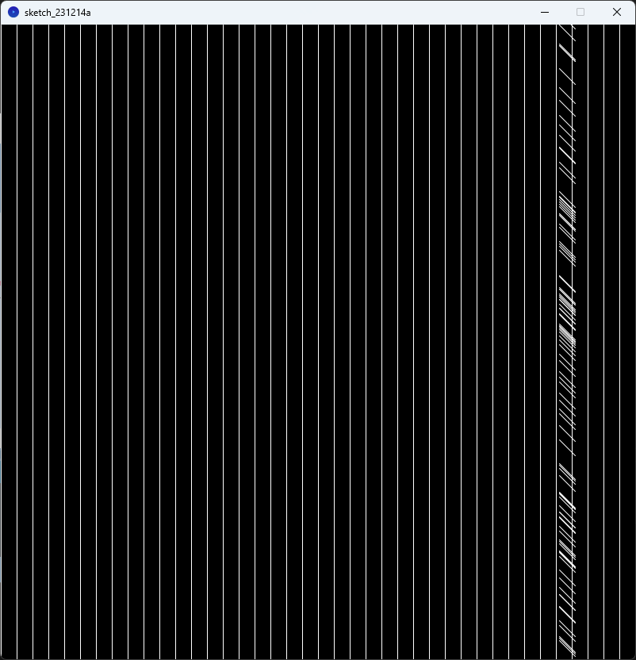
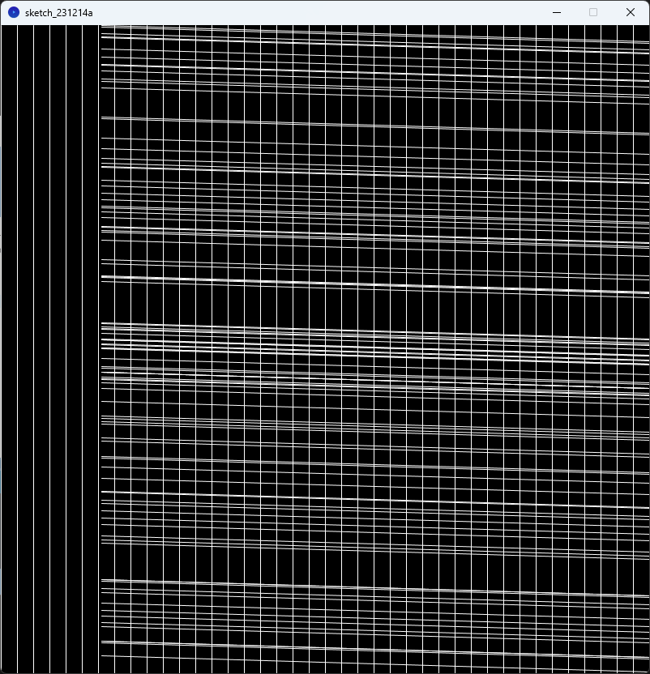
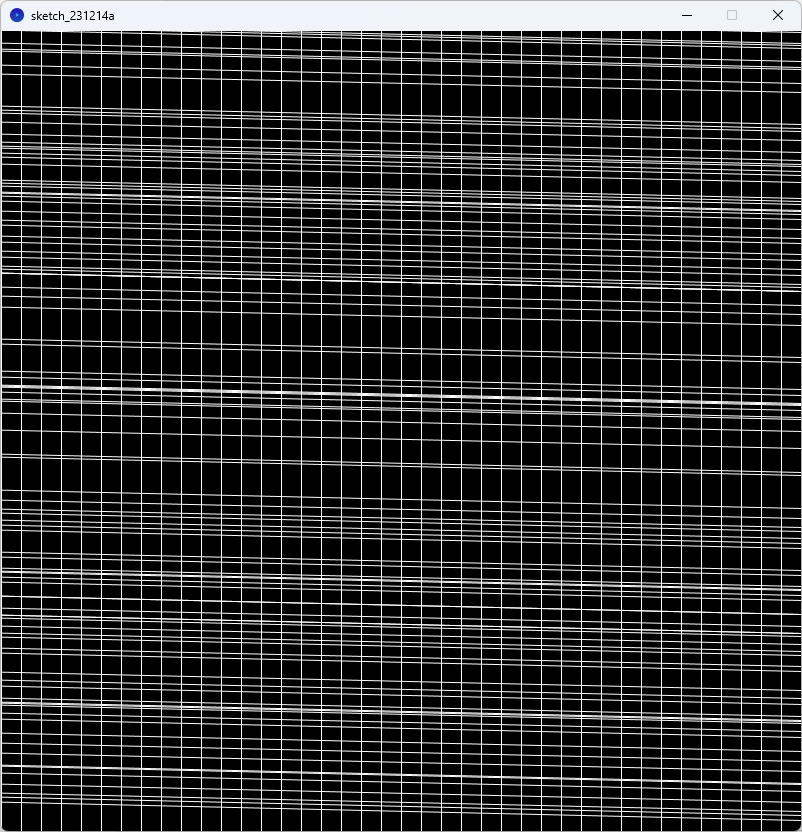
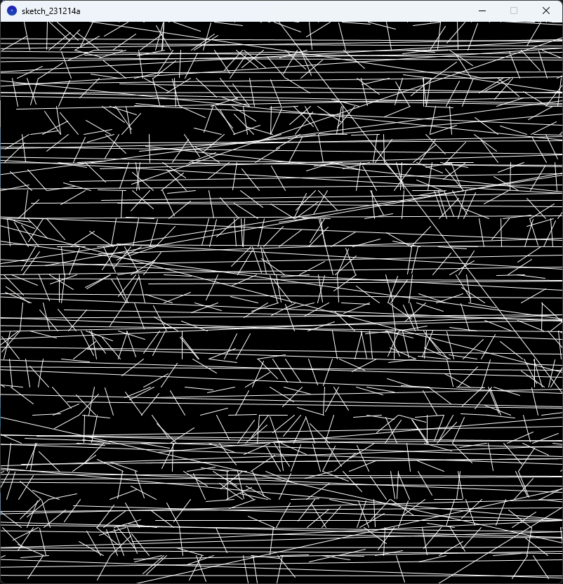
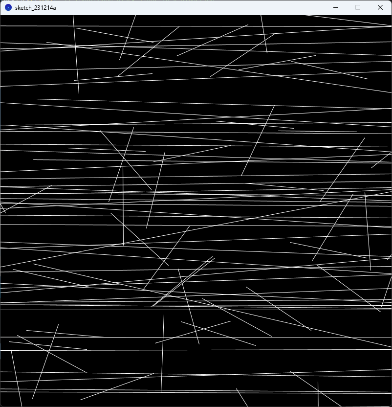
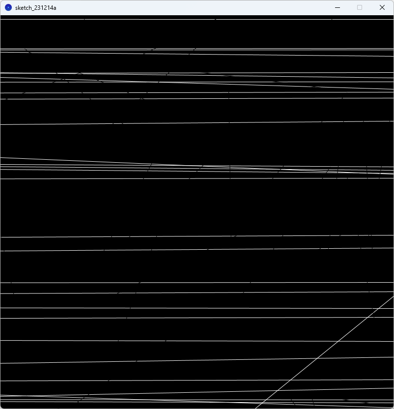

# Casey Reas - METASOTO

**Komentar:**
Ker je v nekaterih korakih zelo malo sprememb ali pa so komaj opazne, so dokumentirani le pomembnejši koraki.

### Pogovor s chat - gpt:

**Vprašanje:**
Could you create a code in processing to recreate Casey Reas artwork based on this describtion?  In METASOTO, Reas offers a “meta” reflection on the work of Jesús Rafael Soto, a Venezuelan Op and kinetic artist of the 1960s who explored the aesthetic possibilities of industrial and synthetic materials such as nylon, steel, and Plexiglas. Soto’s sculptural construction Bois-tiges de fer, 1964, is a Masonite board measuring over five feet wide and painted with vertical black lines, in front of which are hung thin steel wires bent into varying arcs. As the viewer passes in front of the work, the visual interference between the actual and painted lines creates a dizzying optical confusion. In the 1960s, this kind of “activation” of the viewer’s body using nontraditional materials was understood by some as a political act, insofar as it rejected the bourgeois model of art as expensive objects to be passively consumed.

In METASOTO, Reas uses live code that we experience via our browsers to reimagine Soto’s sculpture as a dynamic composition of black and white intersecting lines. The black lines remain static, while the white lines move over them in ways that can make the black lines appear to be animated. Clicking on the image reveals a new pattern (although reloading the work will begin the same cycle over again), and each edition of the work presents an entirely different set of configurations. While Reas’s work reiterates Soto’s embrace of technology to activate the viewer, it also invites us to consider what it means for the viewer to activate technology—or even create their own digital systems."

**Koda iz odgovora in rezultat:**
```java
int numLines = 100; // Number of lines
float[] x = new float[numLines]; // X coordinates for lines
float[] y = new float[numLines]; // Y coordinates for lines
float[] speeds = new float[numLines]; // Speed for each line

void setup() {
  size(800, 800);
  background(0);
  stroke(0);
  
  // Initialize lines
  for (int i = 0; i < numLines; i++) {
    x[i] = random(width);
    y[i] = random(height);
    speeds[i] = random(1, 4);
  }
}

void draw() {
  // Move lines
  for (int i = 0; i < numLines; i++) {
    x[i] += speeds[i];
    if (x[i] > width) {
      x[i] = 0;
      y[i] = random(height);
    }
  }
  
  // Draw static black lines
  for (int i = 0; i < width; i += 20) {
    line(i, 0, i, height);
  }
  
  // Draw moving white lines
  for (int i = 0; i < numLines; i++) {
    stroke(255);
    line(x[i], y[i], x[i] - 20, y[i] - 20);
  }
}

void mousePressed() {
  background(255);
  // Reset lines
  for (int i = 0; i < numLines; i++) {
    x[i] = random(width);
    y[i] = random(height);
    speeds[i] = random(1, 4);
  }
}

```
**Slika:**


**Vprašanje:**
White lines should move from right edge of the screen to the left, they also should not leave a trail
**Koda iz odgovora in rezultat:**
```java
int numLines = 100; // Number of lines
float[] y = new float[numLines]; // Y coordinates for lines
float[] speeds = new float[numLines]; // Speed for each line

void setup() {
  size(800, 800);
  background(0);
  stroke(0);
  
  // Initialize lines
  for (int i = 0; i < numLines; i++) {
    y[i] = random(height);
    speeds[i] = random(1, 4);
  }
}

void draw() {
  // Move lines
  background(0); // Clear the canvas on each frame
  
  // Draw static black lines
  for (int i = 0; i < width; i += 20) {
    line(i, 0, i, height);
  }
  
  // Draw moving white lines
  for (int i = 0; i < numLines; i++) {
    stroke(255);
    float x = map(frameCount % width, 0, width, width, 0); // Calculate x position from right to left
    line(x, y[i], x - 20, y[i] - 20); // Draw white lines moving left
  }
}

void mousePressed() {
  // Reset lines
  for (int i = 0; i < numLines; i++) {
    y[i] = random(height);
    speeds[i] = random(1, 4);
  }
}
```
**Slika:**


**Vprašanje:**
The  lines moving from right to left should extend from right edge to left edge

**Koda iz odgovora in rezultat:**
```java
int numLines = 100; // Number of lines
float[] y = new float[numLines]; // Y coordinates for lines
float[] speeds = new float[numLines]; // Speed for each line

void setup() {
  size(800, 800);
  background(0);
  stroke(0);
  
  // Initialize lines
  for (int i = 0; i < numLines; i++) {
    y[i] = random(height);
    speeds[i] = random(1, 4);
  }
}

void draw() {
  // Move lines
  background(0); // Clear the canvas on each frame
  
  // Draw static black lines
  for (int i = 0; i < width; i += 20) {
    line(i, 0, i, height);
  }
  
  // Draw moving white lines
  for (int i = 0; i < numLines; i++) {
    stroke(255);
    float x1 = width; // Start of line at right edge
    float x2 = map(frameCount % width, 0, width, width, 0); // End of line at left edge
    line(x1, y[i], x2, y[i] - 20); // Draw white lines moving from right to left
  }
}

void mousePressed() {
  // Reset lines
  for (int i = 0; i < numLines; i++) {
    y[i] = random(height);
    speeds[i] = random(1, 4);
  }
}

```
**Slika:**


**Vprašanje:**
The moving lines should extend infinitely beyond the left edge

**Koda iz odgovora in rezultat:**
```java
int numLines = 100; // Number of lines
float[] y = new float[numLines]; // Y coordinates for lines
float[] speeds = new float[numLines]; // Speed for each line
float angle = PI / 4; // Angle of the lines

void setup() {
  size(800, 800);
  background(255);
  stroke(0);
  
  // Initialize lines
  for (int i = 0; i < numLines; i++) {
    y[i] = random(height);
    speeds[i] = random(3, 8); // Increase the speed range for faster movement
  }
}

void draw() {
  // Move lines
  background(255); // Clear the canvas on each frame
  
  // Draw static black lines
  for (int i = 0; i < width; i += 20) {
    line(i, 0, i, height);
  }
  
  // Draw moving white lines
  for (int i = 0; i < numLines; i++) {
    stroke(255);
    float x1 = width; // Start of line at right edge
    float x2 = map(frameCount % (width * 10), 0, width * 10, width, -width * 9); // End of line extended indefinitely beyond the left edge
    float speedAdjustedX2 = x2 - speeds[i] * (frameCount % (width * 10)); // Adjust speed for faster movement
    float adjustedY = y[i] - 20 * tan(angle); // Adjust Y position based on the angle
    
    line(x1, y[i], speedAdjustedX2, adjustedY); // Draw white lines moving from right to left at an angle
  }
}

void mousePressed() {
  // Reset lines
  for (int i = 0; i < numLines; i++) {
    y[i] = random(height);
    speeds[i] = random(3, 8);
  }
}

```
**Slika:**


**Vprašanje:**
Make the black static and moving lines start at random angles, static lines should be in front of the moving lines


**Koda iz odgovora in rezultat:**
```java
int numLines = 100; // Number of lines
float[] initialYWhite = new float[numLines]; // Initial Y coordinates for white lines
float[] initialAngle = new float[numLines]; // Initial angles for white lines
float[] speedsWhite = new float[numLines]; // Speed for each white line

float[][] initialCoordinatesBlack; // Initial coordinates for black lines
float[][] initialAnglesBlack; // Initial angles for black lines

void setup() {
  size(800, 800);
  background(0);
  stroke(0);

  initialCoordinatesBlack = new float[width / 20][height / 40]; // Storing initial coordinates for black lines
  initialAnglesBlack = new float[width / 20][height / 40]; // Storing initial angles for black lines
  
  // Initialize white lines
  for (int i = 0; i < numLines; i++) {
    initialYWhite[i] = random(height);
    initialAngle[i] = random(TWO_PI); // Random initial angles for white lines
    speedsWhite[i] = random(3, 8); // Increase the speed range for faster movement for white lines
  }

  // Initialize black lines
  for (int i = 0; i < width / 20; i++) {
    for (int j = 0; j < height / 40; j++) {
      initialCoordinatesBlack[i][j] = random(width); // Random initial x-coordinate for black lines
      initialAnglesBlack[i][j] = random(TWO_PI); // Random initial angles for black lines
    }
  }
}

void draw() {
  // Move white lines
  background(0); // Clear the canvas on each frame

  // Draw moving white lines
  for (int i = 0; i < numLines; i++) {
    stroke(255);
    float x1 = width; // Start of line at right edge
    float x2 = map(frameCount % (width * 10), 0, width * 10, width, -width * 9); // End of line extended indefinitely beyond the left edge
    float speedAdjustedX2 = x2 - speedsWhite[i] * (frameCount % (width * 10)); // Adjust speed for faster movement
    float adjustedY = initialYWhite[i] - 20 * tan(initialAngle[i]); // Use initial angle and position
    
    line(x1, initialYWhite[i], speedAdjustedX2, adjustedY); // Draw white lines moving from right to left at their initial angle
  }

  // Draw static black lines (web-like arrangement)
  for (int i = 0; i < width / 20; i++) {
    for (int j = 0; j < height / 40; j++) {
      float x1 = initialCoordinatesBlack[i][j];
      float y1 = j * 40;
      float x2 = x1 + 40 * cos(initialAnglesBlack[i][j]); // Lengthened black lines in x-direction
      float y2 = y1 + 40 * sin(initialAnglesBlack[i][j]); // Lengthened black lines in y-direction
      
      line(x1, y1, x2, y2);
    }
  }
}

void mousePressed() {
  // Reset white lines
  for (int i = 0; i < numLines; i++) {
    initialYWhite[i] = random(height);
    speedsWhite[i] = random(3, 8);
  }
  
  // Reset black lines
  for (int i = 0; i < width / 20; i++) {
    for (int j = 0; j < height / 40; j++) {
      initialCoordinatesBlack[i][j] = random(width);
      initialAnglesBlack[i][j] = random(TWO_PI);
    }
  }
}
```
**Slika:**


**Vprašanje:**
Make less black lines but make them longer
**Koda iz odgovora in rezultat:**
```java
int numLines = 50; // Number of black lines
float[] initialYWhite = new float[numLines]; // Initial Y coordinates for white lines
float[] initialAngle = new float[numLines]; // Initial angles for white lines
float[] speedsWhite = new float[numLines]; // Speed for each white line

float[][] initialCoordinatesBlack; // Initial coordinates for black lines
float[][] initialAnglesBlack; // Initial angles for black lines

void setup() {
  size(800, 800);
  background(0);
  stroke(0);

  initialCoordinatesBlack = new float[numLines][2]; // Storing initial coordinates for black lines
  initialAnglesBlack = new float[numLines][1]; // Storing initial angles for black lines
  
  // Initialize white lines
  for (int i = 0; i < numLines; i++) {
    initialYWhite[i] = random(height);
    initialAngle[i] = random(TWO_PI); // Random initial angles for white lines
    speedsWhite[i] = random(3, 8); // Increase the speed range for faster movement for white lines
  }

  // Initialize black lines
  for (int i = 0; i < numLines; i++) {
    initialCoordinatesBlack[i][0] = random(width); // Random initial x-coordinate for black lines
    initialCoordinatesBlack[i][1] = random(height); // Random initial y-coordinate for black lines
    initialAnglesBlack[i][0] = random(TWO_PI); // Random initial angles for black lines
  }
}

void draw() {
  // Move white lines
  background(0); // Clear the canvas on each frame

  // Draw moving white lines
  for (int i = 0; i < numLines; i++) {
    stroke(255);
    float x1 = width; // Start of line at right edge
    float x2 = map(frameCount % (width * 10), 0, width * 10, width, -width * 9); // End of line extended indefinitely beyond the left edge
    float speedAdjustedX2 = x2 - speedsWhite[i] * (frameCount % (width * 10)); // Adjust speed for faster movement
    float adjustedY = initialYWhite[i] - 20 * tan(initialAngle[i]); // Use initial angle and position
    
    line(x1, initialYWhite[i], speedAdjustedX2, adjustedY); // Draw white lines moving from right to left at their initial angle
  }

  // Draw static black lines (web-like arrangement)
  for (int i = 0; i < numLines; i++) {
    float x1 = initialCoordinatesBlack[i][0];
    float y1 = initialCoordinatesBlack[i][1];
    float x2 = x1 + 160 * cos(initialAnglesBlack[i][0]); // Lengthened black lines in x-direction
    float y2 = y1 + 160 * sin(initialAnglesBlack[i][0]); // Lengthened black lines in y-direction
    
    line(x1, y1, x2, y2);
  }
}

void mousePressed() {
  // Reset white lines
  for (int i = 0; i < numLines; i++) {
    initialYWhite[i] = random(height);
    speedsWhite[i] = random(3, 8);
  }
  
  // Reset black lines
  for (int i = 0; i < numLines; i++) {
    initialCoordinatesBlack[i][0] = random(width);
    initialCoordinatesBlack[i][1] = random(height);
    initialAnglesBlack[i][0] = random(TWO_PI);
  }
}

```
**Slika:**


**Vprašanje:**
Make the black lines black colored

**Koda iz odgovora in rezultat:**
```java
int numLines = 30; // Number of black lines
float[] initialYWhite = new float[numLines]; // Initial Y coordinates for white lines
float[] initialAngle = new float[numLines]; // Initial angles for white lines
float[] speedsWhite = new float[numLines]; // Speed for each white line

float[][] initialCoordinatesBlack; // Initial coordinates for black lines
float[][] initialAnglesBlack; // Initial angles for black lines

void setup() {
  size(800, 800);
  background(0);
  stroke(0);

  initialCoordinatesBlack = new float[numLines][2]; // Storing initial coordinates for black lines
  initialAnglesBlack = new float[numLines][1]; // Storing initial angles for black lines
  
  // Initialize white lines
  for (int i = 0; i < numLines; i++) {
    initialYWhite[i] = random(height);
    initialAngle[i] = random(TWO_PI); // Random initial angles for white lines
    
    // Assigning varied speed ranges to different lines
    if (i % 3 == 0) {
      speedsWhite[i] = random(0.5, 1.5); // Slower speed for lines with index divisible by 3
    } else if (i % 3 == 1) {
      speedsWhite[i] = random(1.5, 3); // Moderate speed for lines with index remainder 1
    } else {
      speedsWhite[i] = random(3, 5); // Faster speed for lines with index remainder 2
    }
  }

  // Initialize black lines
  for (int i = 0; i < numLines; i++) {
    initialCoordinatesBlack[i][0] = random(width); // Random initial x-coordinate for black lines
    initialCoordinatesBlack[i][1] = random(height); // Random initial y-coordinate for black lines
    initialAnglesBlack[i][0] = random(TWO_PI); // Random initial angles for black lines
  }
}

void draw() {
  // Move white lines
  background(0); // Clear the canvas on each frame

  // Draw moving white lines
  for (int i = 0; i < numLines; i++) {
    stroke(255);
    float x1 = width; // Start of line at right edge
    float x2 = map(frameCount % (width * 10), 0, width * 10, width, -width * 9); // End of line extended indefinitely beyond the left edge
    float speedAdjustedX2 = x2 - speedsWhite[i] * (frameCount % (width * 10)); // Adjust speed for slower/faster movement
    float adjustedY = initialYWhite[i] - 20 * tan(initialAngle[i]); // Use initial angle and position
    
    line(x1, initialYWhite[i], speedAdjustedX2, adjustedY); // Draw white lines moving from right to left at their initial angle
  }

  // Draw static black lines (web-like arrangement)
  stroke(0); // Set stroke color to black
  for (int i = 0; i < numLines; i++) {
    float x1 = initialCoordinatesBlack[i][0];
    float y1 = initialCoordinatesBlack[i][1];
    float x2 = x1 + 320 * cos(initialAnglesBlack[i][0]); // Longer black lines in x-direction
    float y2 = y1 + 320 * sin(initialAnglesBlack[i][0]); // Longer black lines in y-direction
    
    line(x1, y1, x2, y2);
  }
}

void mousePressed() {
  // Reset white lines
  for (int i = 0; i < numLines; i++) {
    initialYWhite[i] = random(height);
    
    // Assigning varied speed ranges to different lines
    if (i % 3 == 0) {
      speedsWhite[i] = random(0.5, 1.5); // Slower speed for lines with index divisible by 3
    } else if (i % 3 == 1) {
      speedsWhite[i] = random(1.5, 3); // Moderate speed for lines with index remainder 1
    } else {
      speedsWhite[i] = random(3, 5); // Faster speed for lines with index remainder 2
    }
  }
  
  // Reset black lines
  for (int i = 0; i < numLines; i++) {
    initialCoordinatesBlack[i][0] = random(width);
    initialCoordinatesBlack[i][1] = random(height);
    initialAnglesBlack[i][0] = random(TWO_PI);
  }
}

```
**Slika:**


**Dodatno:** V kodi je bilo treba izbrisati del pod  ```Reset black lines```, da je bilo delovanje čim bolj podobno originalu.
