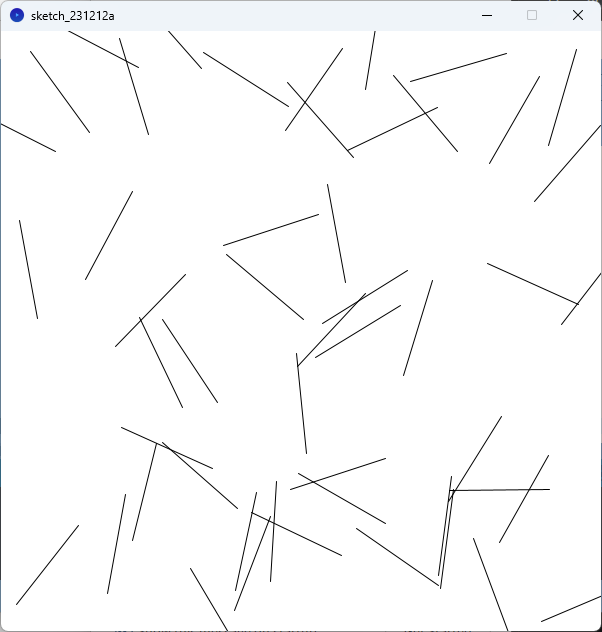
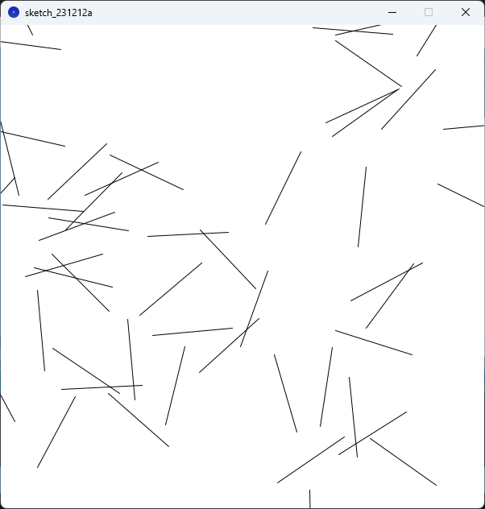
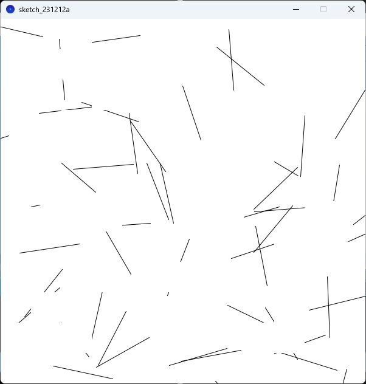
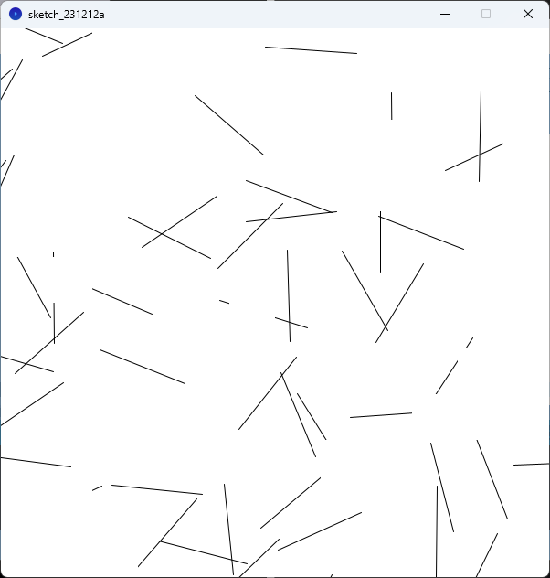
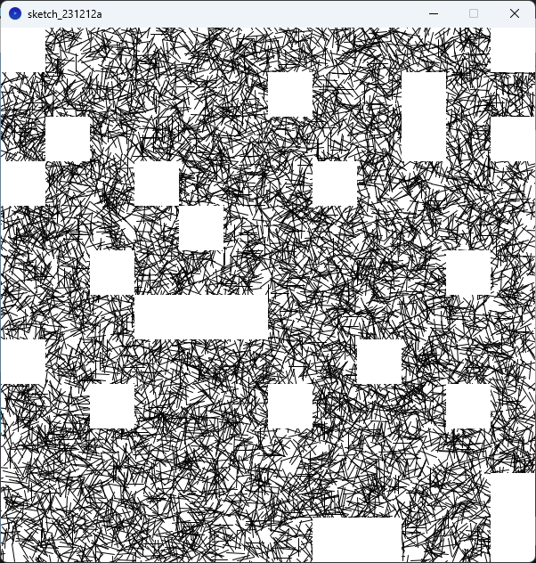
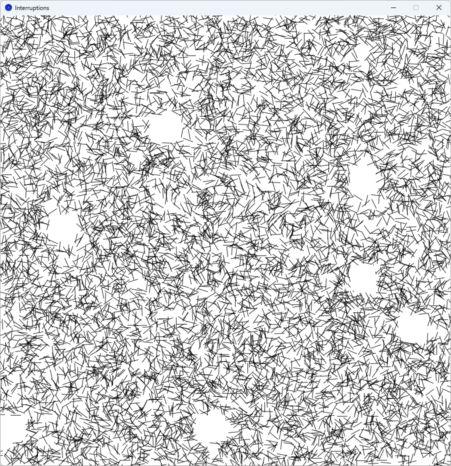

# Vera Molnar - Interruptions

### Pogovor s chat - gpt:

**Vprašanje:**
Could you create processing code for this describtion of her artwork? In this series, the artist starts with a grid covered with straight lines of the same length, and applies random rotation to each, generating a densely complex pattern that suggests the action if different forces that introduce chaos on a regular structure. To this, Molnar adds the “interruptions,” random sections in which certain lines are erased, thus creating voids shaped both by the missing elements and those nearby.


**Koda iz odgovora in rezultat:**
```java
ArrayList<Line> lines; // Arraylist to store lines

void setup() {
  size(600, 600);
  background(255);
  
  lines = new ArrayList<Line>();
  int numLines = 50; // Number of lines
  
  // Create the initial grid of straight lines
  for (int i = 0; i < numLines; i++) {
    Line line = new Line(random(width), random(height), random(TWO_PI)); // Random x, y, and angle
    lines.add(line);
  }
  
  // Apply rotations and interruptions
  applyRotations();
  applyInterruptions();
  
  // Draw the lines
  for (Line line : lines) {
    line.display();
  }
}

void applyRotations() {
  // Apply random rotations to each line
  for (Line line : lines) {
    line.rotate(random(-PI/4, PI/4)); // Random rotation within a range
  }
}

void applyInterruptions() {
  // Apply interruptions by erasing random sections of lines
  for (int i = 0; i < lines.size(); i++) {
    Line line = lines.get(i);
    float start = random(line.length); // Random starting point
    float end = start + random(10, 50); // Random section length
    
    line.erase(start, end); // Erase a random section of the line
  }
}

class Line {
  float x, y, angle;
  float length = 100; // Initial length of the line
  
  Line(float x, float y, float angle) {
    this.x = x;
    this.y = y;
    this.angle = angle;
  }
  
  void rotate(float rotation) {
    angle += rotation; // Apply rotation to the angle of the line
  }
  
  void erase(float start, float end) {
    // Erase a section of the line between start and end points
    stroke(255);
    strokeWeight(2);
    float x1 = x + cos(angle) * start;
    float y1 = y + sin(angle) * start;
    float x2 = x + cos(angle) * end;
    float y2 = y + sin(angle) * end;
    line(x1, y1, x2, y2);
  }
  
  void display() {
    // Display the line
    stroke(0);
    strokeWeight(1);
    float xEnd = x + cos(angle) * length;
    float yEnd = y + sin(angle) * length;
    line(x, y, xEnd, yEnd);
  }
}
```
**Slika:**


**Vprašanje:**
could you make it so the section erased is bigger and more noticable?


**Koda iz odgovora in rezultat:**
```java
ArrayList<Line> lines; // Arraylist to store lines

void setup() {
  size(600, 600);
  background(255);
  
  lines = new ArrayList<Line>();
  int numLines = 50; // Number of lines
  
  // Create the initial grid of straight lines
  for (int i = 0; i < numLines; i++) {
    Line line = new Line(random(width), random(height), random(TWO_PI)); // Random x, y, and angle
    lines.add(line);
  }
  
  // Apply rotations and interruptions
  applyRotations();
  applyInterruptions();
  
  // Draw the lines
  for (Line line : lines) {
    line.display();
  }
}

void applyRotations() {
  // Apply random rotations to each line
  for (Line line : lines) {
    line.rotate(random(-PI/4, PI/4)); // Random rotation within a range
  }
}

void applyInterruptions() {
  // Apply interruptions by erasing random sections of lines
  for (int i = 0; i < lines.size(); i++) {
    Line line = lines.get(i);
    float start = random(line.length * 0.2, line.length * 0.4); // Random starting point
    float end = start + random(line.length * 0.4, line.length * 0.6); // Random section length
    
    line.erase(start, end); // Erase a random section of the line
  }
}

class Line {
  float x, y, angle;
  float length = 100; // Initial length of the line
  
  Line(float x, float y, float angle) {
    this.x = x;
    this.y = y;
    this.angle = angle;
  }
  
  void rotate(float rotation) {
    angle += rotation; // Apply rotation to the angle of the line
  }
  
  void erase(float start, float end) {
    // Erase a section of the line between start and end points
    stroke(255);
    strokeWeight(6); // Increased stroke weight for more noticeable erasure
    float x1 = x + cos(angle) * start;
    float y1 = y + sin(angle) * start;
    float x2 = x + cos(angle) * end;
    float y2 = y + sin(angle) * end;
    line(x1, y1, x2, y2);
  }
  
  void display() {
    // Display the line
    stroke(0);
    strokeWeight(1);
    float xEnd = x + cos(angle) * length;
    float yEnd = y + sin(angle) * length;
    line(x, y, xEnd, yEnd);
  }
}
```
**Slika:**


**Vprašanje:**
Try to erase areas rather than singular line sections


**Koda iz odgovora in rezultat:**
```java
ArrayList<Line> lines; // Arraylist to store lines
ArrayList<PVector> interruptions; // Arraylist to store interrupted areas

void setup() {
  size(600, 600);
  background(255);
  
  lines = new ArrayList<Line>();
  int numLines = 50; // Number of lines
  
  // Create the initial grid of straight lines
  for (int i = 0; i < numLines; i++) {
    Line line = new Line(random(width), random(height), random(TWO_PI)); // Random x, y, and angle
    lines.add(line);
  }
  
  // Apply rotations
  applyRotations();
  
  // Create interrupted areas
  interruptions = createInterruptions();
  
  // Draw the lines
  for (Line line : lines) {
    line.display();
  }
  
  // Draw interrupted areas
  noStroke();
  fill(255);
  for (PVector interrupt : interruptions) {
    rect(interrupt.x, interrupt.y, 50, 50); // Adjust size of the interrupted areas
  }
}

void applyRotations() {
  // Apply random rotations to each line
  for (Line line : lines) {
    line.rotate(random(-PI/4, PI/4)); // Random rotation within a range
  }
}

ArrayList<PVector> createInterruptions() {
  ArrayList<PVector> interrupts = new ArrayList<PVector>();
  
  // Create interrupted areas by defining regions without lines
  for (int i = 0; i < width; i += 50) {
    for (int j = 0; j < height; j += 50) {
      if (random(1) > 0.8) { // Adjust the probability for interruptions
        interrupts.add(new PVector(i, j));
      }
    }
  }
  
  return interrupts;
}

class Line {
  float x, y, angle;
  float length = 100; // Initial length of the line
  
  Line(float x, float y, float angle) {
    this.x = x;
    this.y = y;
    this.angle = angle;
  }
  
  void rotate(float rotation) {
    angle += rotation; // Apply rotation to the angle of the line
  }
  
  void display() {
    // Display the line
    stroke(0);
    strokeWeight(1);
    float xEnd = x + cos(angle) * length;
    float yEnd = y + sin(angle) * length;
    line(x, y, xEnd, yEnd);
  }
}

```
**Slika:**


**Vprašanje:**
could you also make it so that if a line is erased by less than 50% it stays visible instead of being erased?

**Koda iz odgovora in rezultat:**
```java
ArrayList<Line> lines; // Arraylist to store lines
ArrayList<PVector> interruptions; // Arraylist to store interrupted areas

void setup() {
  size(600, 600);
  background(255);
  
  lines = new ArrayList<Line>();
  int numLines = 50; // Number of lines
  
  // Create the initial grid of straight lines
  for (int i = 0; i < numLines; i++) {
    Line line = new Line(random(width), random(height), random(TWO_PI)); // Random x, y, and angle
    lines.add(line);
  }
  
  // Apply rotations
  applyRotations();
  
  // Create interrupted areas
  interruptions = createInterruptions();
  
  // Draw the lines
  for (Line line : lines) {
    line.display();
  }
  
  // Draw interrupted areas
  noStroke();
  fill(255);
  for (PVector interrupt : interruptions) {
    rect(interrupt.x, interrupt.y, 50, 50); // Adjust size of the interrupted areas
  }
}

void applyRotations() {
  // Apply random rotations to each line
  for (Line line : lines) {
    line.rotate(random(-PI/4, PI/4)); // Random rotation within a range
  }
}

ArrayList<PVector> createInterruptions() {
  ArrayList<PVector> interrupts = new ArrayList<PVector>();
  
  // Create interrupted areas by defining regions without lines
  for (int i = 0; i < width; i += 50) {
    for (int j = 0; j < height; j += 50) {
      if (random(1) > 0.8) { // Adjust the probability for interruptions
        interrupts.add(new PVector(i, j));
      }
    }
  }
  
  return interrupts;
}

class Line {
  float x, y, angle;
  float length = 100; // Initial length of the line
  
  Line(float x, float y, float angle) {
    this.x = x;
    this.y = y;
    this.angle = angle;
  }
  
  void rotate(float rotation) {
    angle += rotation; // Apply rotation to the angle of the line
  }
  
  boolean isInsideInterruption(float x1, float y1, float x2, float y2) {
    // Check if the line segment intersects with any of the interruptions
    for (PVector interrupt : interruptions) {
      if (x1 >= interrupt.x && x1 <= interrupt.x + 50 && y1 >= interrupt.y && y1 <= interrupt.y + 50) {
        return true;
      }
      if (x2 >= interrupt.x && x2 <= interrupt.x + 50 && y2 >= interrupt.y && y2 <= interrupt.y + 50) {
        return true;
      }
    }
    return false;
  }
  
  void display() {
    // Display the line
    float xEnd = x + cos(angle) * length;
    float yEnd = y + sin(angle) * length;
    
    boolean insideInterruption = isInsideInterruption(x, y, xEnd, yEnd);
    
    if (!insideInterruption || dist(x, y, xEnd, yEnd) > 25) {
      stroke(0);
      strokeWeight(1);
      line(x, y, xEnd, yEnd);
    }
  }
}

```
**Slika:**


**Vprašanje:**
could you make it so that there is 10000 lines on the screen, make the lines 5 times shorter

**Koda iz odgovora in rezultat:**
```java
ArrayList<Line> lines; // Arraylist to store lines
ArrayList<PVector> interruptions; // Arraylist to store interrupted areas

void setup() {
  size(600, 600);
  background(255);
  
  lines = new ArrayList<Line>();
  int numLines = 10000; // Number of lines
  
  // Create the initial grid of straight lines
  for (int i = 0; i < numLines; i++) {
    Line line = new Line(random(width), random(height), random(TWO_PI)); // Random x, y, and angle
    lines.add(line);
  }
  
  // Apply rotations
  applyRotations();
  
  // Create interrupted areas
  interruptions = createInterruptions();
  
  // Draw the lines
  for (Line line : lines) {
    line.display();
  }
  
  // Draw interrupted areas
  noStroke();
  fill(255);
  for (PVector interrupt : interruptions) {
    rect(interrupt.x, interrupt.y, 50, 50); // Adjust size of the interrupted areas
  }
}

void applyRotations() {
  // Apply random rotations to each line
  for (Line line : lines) {
    line.rotate(random(-PI/4, PI/4)); // Random rotation within a range
  }
}

ArrayList<PVector> createInterruptions() {
  ArrayList<PVector> interrupts = new ArrayList<PVector>();
  
  // Create interrupted areas by defining regions without lines
  for (int i = 0; i < width; i += 50) {
    for (int j = 0; j < height; j += 50) {
      if (random(1) > 0.8) { // Adjust the probability for interruptions
        interrupts.add(new PVector(i, j));
      }
    }
  }
  
  return interrupts;
}

class Line {
  float x, y, angle;
  float length = 20; // Shorter length of the line
  
  Line(float x, float y, float angle) {
    this.x = x;
    this.y = y;
    this.angle = angle;
  }
  
  void rotate(float rotation) {
    angle += rotation; // Apply rotation to the angle of the line
  }
  
  boolean isInsideInterruption(float x1, float y1, float x2, float y2) {
    // Check if the line segment intersects with any of the interruptions
    for (PVector interrupt : interruptions) {
      if (x1 >= interrupt.x && x1 <= interrupt.x + 50 && y1 >= interrupt.y && y1 <= interrupt.y + 50) {
        return true;
      }
      if (x2 >= interrupt.x && x2 <= interrupt.x + 50 && y2 >= interrupt.y && y2 <= interrupt.y + 50) {
        return true;
      }
    }
    return false;
  }
  
  void display() {
    // Display the line
    float xEnd = x + cos(angle) * length;
    float yEnd = y + sin(angle) * length;
    
    boolean insideInterruption = isInsideInterruption(x, y, xEnd, yEnd);
    
    if (!insideInterruption || dist(x, y, xEnd, yEnd) > 10) {
      stroke(0);
      strokeWeight(1);
      line(x, y, xEnd, yEnd);
    }
  }
}

```
**Slika:**


**Vprašanje:**
Make it so the line is not completely erased if less than 50% of it is in the interruption, make interruptions less frequent.
**Dodatno:**
Ročno sem povečal velikost slike, zato da so linije manj tesne na sliki.

**Koda iz odgovora in rezultat:**
```java
ArrayList<Line> lines; // Arraylist to store lines
ArrayList<PVector> interruptions; // Arraylist to store interrupted areas

void setup() {
  size(900, 900);
  background(255);
  
  lines = new ArrayList<Line>();
  int numLines = 10000; // Number of lines
  
  // Create the initial grid of straight lines
  for (int i = 0; i < numLines; i++) {
    Line line = new Line(random(width), random(height), random(TWO_PI)); // Random x, y, and angle
    lines.add(line);
  }
  
  // Apply rotations
  applyRotations();
  
  // Create interrupted areas
  interruptions = createInterruptions();
  
  // Draw the lines
  for (Line line : lines) {
    line.display();
  }
  
  // Draw interrupted areas
  noStroke();
  fill(255);
  for (PVector interrupt : interruptions) {
    rect(interrupt.x, interrupt.y, 50, 50); // Adjust size of the interrupted areas
  }
}

void applyRotations() {
  // Apply random rotations to each line
  for (Line line : lines) {
    line.rotate(random(-PI/4, PI/4)); // Random rotation within a range
  }
}

ArrayList<PVector> createInterruptions() {
  ArrayList<PVector> interrupts = new ArrayList<PVector>();
  
  // Create interrupted areas by defining regions without lines
  for (int i = 0; i < width; i += 100) {
    for (int j = 0; j < height; j += 100) {
      if (random(1) > 0.9) { // Adjust the probability for interruptions
        interrupts.add(new PVector(i, j));
      }
    }
  }
  
  return interrupts;
}

class Line {
  float x, y, angle;
  float length = 20; // Shorter length of the line
  
  Line(float x, float y, float angle) {
    this.x = x;
    this.y = y;
    this.angle = angle;
  }
  
  void rotate(float rotation) {
    angle += rotation; // Apply rotation to the angle of the line
  }
  
  boolean isInsideInterruption(float x1, float y1, float x2, float y2) {
    // Check if the line segment intersects with any of the interruptions
    for (PVector interrupt : interruptions) {
      if (x1 >= interrupt.x && x1 <= interrupt.x + 50 && y1 >= interrupt.y && y1 <= interrupt.y + 50) {
        return true;
      }
      if (x2 >= interrupt.x && x2 <= interrupt.x + 50 && y2 >= interrupt.y && y2 <= interrupt.y + 50) {
        return true;
      }
    }
    return false;
  }
  
  void display() {
    // Display the line
    float xEnd = x + cos(angle) * length;
    float yEnd = y + sin(angle) * length;
    
    boolean insideInterruptionStart = isInsideInterruption(x, y, x, y);
    boolean insideInterruptionEnd = isInsideInterruption(xEnd, yEnd, xEnd, yEnd);
    
    if (!insideInterruptionStart && !insideInterruptionEnd) {
      stroke(0);
      strokeWeight(1);
      line(x, y, xEnd, yEnd);
    }
  }
}
```
**Slika:**



