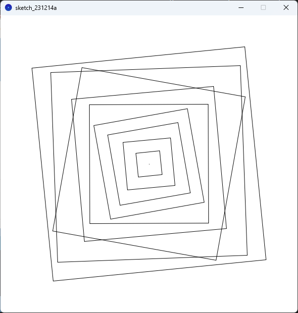
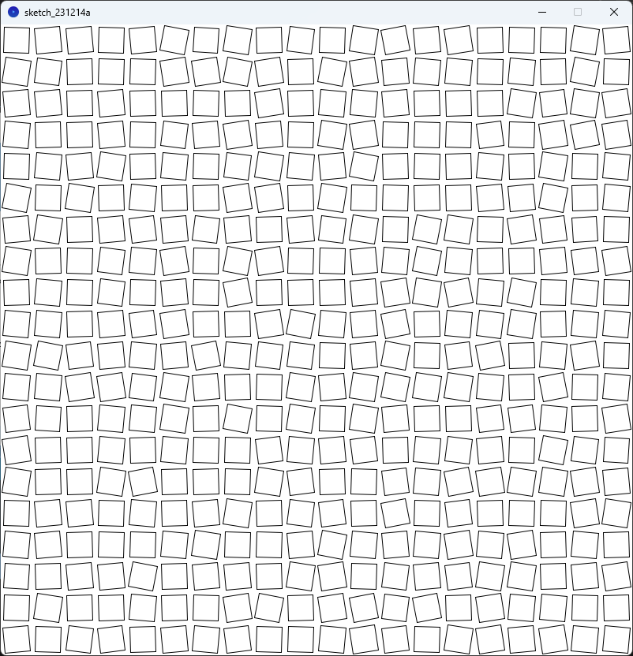
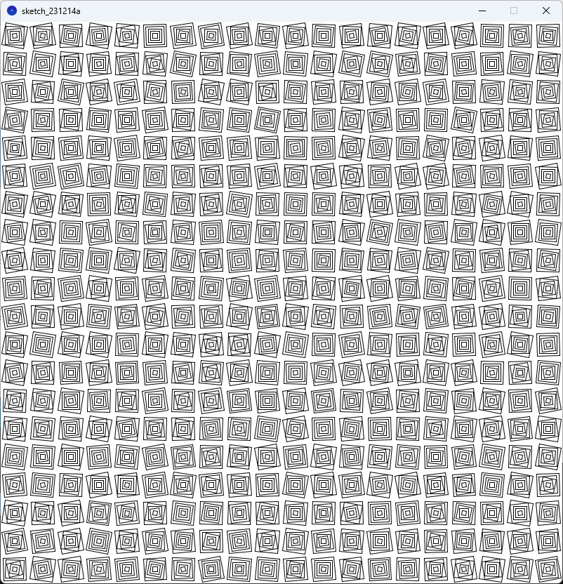
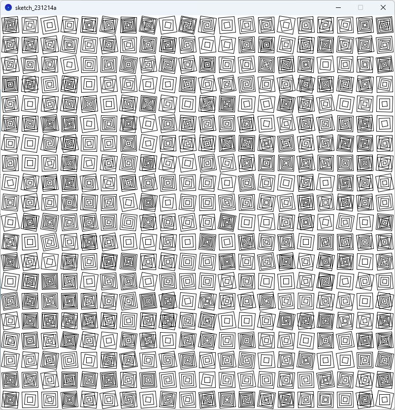
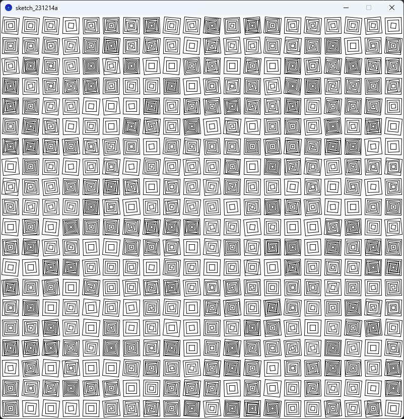
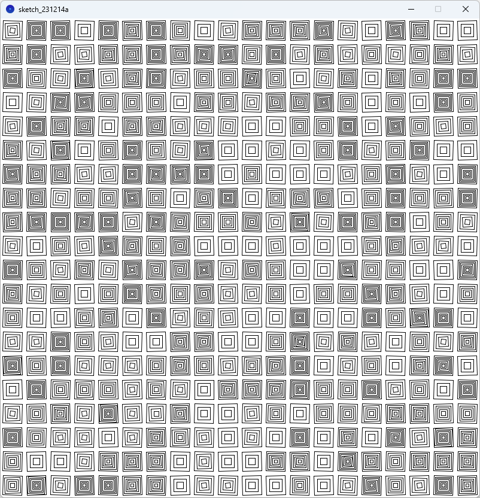
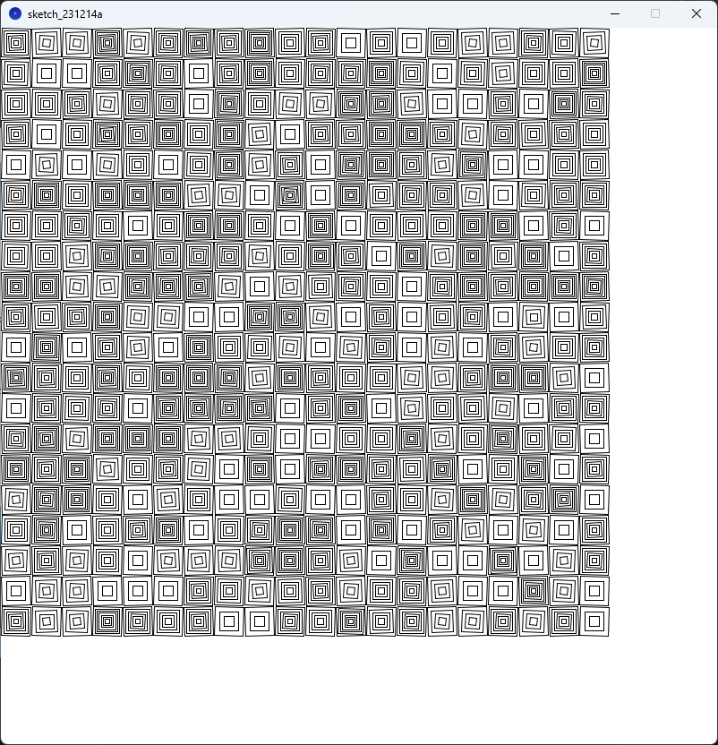
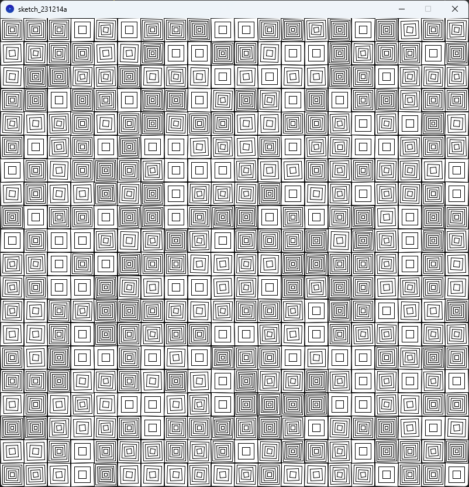
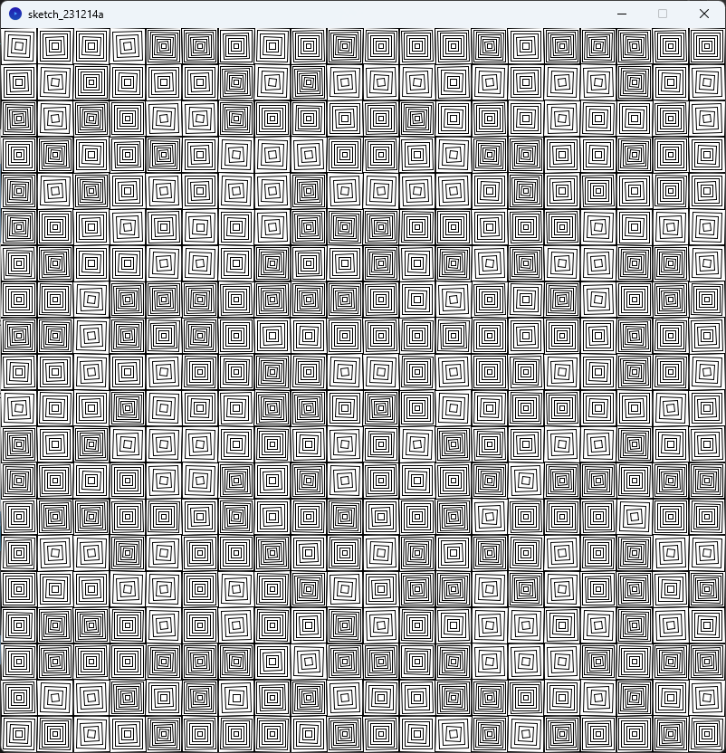

# Vera Molnar - Des Ordes

### Pogovor s chat - gpt:

**Vprašanje:**
Could you create a code in processing to recreate Vera Molnars artwork based on this describtion? In this series, Vera Molnar creates a pattern of concentric squares which is randomly disrupted in order to highlight the contrast between order and disorder and create tensions in the ortogonal structure, as if the squares were subject to a vibrating force. The title suggests a word play in French between two meanings: “désordres” (disorders) and “des ordres” (some orders), which implies that within the apparent dissarray one can find an underlying logic, the idea is to create many squares that have smaller squares nested within them, which also have smaller squares nested within them and so on.. they are also disrupted by some tiny random rotation, the squares are side by side

**Koda iz odgovora in rezultat:**
```java
int numSquares = 10; // Number of concentric squares
float maxRotation = PI / 16; // Maximum rotation angle

void setup() {
  size(600, 600);
  background(255);
  smooth();
  noFill();
  stroke(0);
  rectMode(CENTER);
  
  float maxSize = min(width, height) * 0.8; // Maximum size for the outer square
  float stepSize = maxSize / numSquares; // Size difference between squares
  
  for (int i = 0; i < numSquares; i++) {
    float squareSize = stepSize * i;
    float rotation = random(-maxRotation, maxRotation);
    drawConcentricSquare(width / 2, height / 2, squareSize, rotation);
  }
}

void drawConcentricSquare(float x, float y, float size, float rotation) {
  pushMatrix();
  translate(x, y);
  rotate(rotation);
  rect(0, 0, size, size);
  popMatrix();
}

```
**Slika:**


**Vprašanje:**
Now generate 20 of these squares one next to the other in a grid pattern

**Koda iz odgovora in rezultat:**
```java
int numSquares = 10; // Number of concentric squares
float maxRotation = PI / 16; // Maximum rotation angle
int gridSize = 20; // Number of squares in the grid

void setup() {
  size(800, 800);
  background(255);
  smooth();
  noFill();
  stroke(0);
  rectMode(CENTER);
  
  float maxSize = min(width, height) * 0.8 / gridSize; // Maximum size for the outer square
  float stepSize = maxSize / numSquares; // Size difference between squares
  
  for (int i = 0; i < gridSize; i++) {
    for (int j = 0; j < gridSize; j++) {
      float posX = (j + 0.5) * width / gridSize;
      float posY = (i + 0.5) * height / gridSize;
      float squareSize = stepSize * numSquares;
      float rotation = random(-maxRotation, maxRotation);
      drawConcentricSquare(posX, posY, squareSize, rotation);
    }
  }
}

void drawConcentricSquare(float x, float y, float size, float rotation) {
  pushMatrix();
  translate(x, y);
  rotate(rotation);
  rect(0, 0, size, size);
  popMatrix();
}

```
**Slika:**


**Vprašanje:**
Each of the generated squares should have nested squares inside of them


**Koda iz odgovora in rezultat:**
```java
int numSquares = 5; // Number of concentric squares inside each square
float maxRotation = PI / 16; // Maximum rotation angle
int gridSize = 20; // Number of squares in the grid

void setup() {
  size(800, 800);
  background(255);
  smooth();
  noFill();
  stroke(0);
  rectMode(CENTER);
  
  float maxSize = min(width, height) * 0.8 / gridSize; // Maximum size for the outer square
  float stepSize = maxSize / numSquares; // Size difference between squares
  
  for (int i = 0; i < gridSize; i++) {
    for (int j = 0; j < gridSize; j++) {
      float posX = (j + 0.5) * width / gridSize;
      float posY = (i + 0.5) * height / gridSize;
      float squareSize = stepSize * numSquares;
      float rotation = random(-maxRotation, maxRotation);
      drawConcentricSquares(posX, posY, squareSize, numSquares, rotation);
    }
  }
}

void drawConcentricSquares(float x, float y, float size, int numSquares, float rotation) {
  float stepSize = size / numSquares;
  
  for (int i = 0; i < numSquares; i++) {
    float newSize = stepSize * (i + 1);
    float newRotation = random(-maxRotation, maxRotation);
    drawConcentricSquare(x, y, newSize, newRotation);
  }
}

void drawConcentricSquare(float x, float y, float size, float rotation) {
  pushMatrix();
  translate(x, y);
  rotate(rotation);
  rect(0, 0, size, size);
  popMatrix();
}
```
**Slika:**


**Vprašanje:**
Now make it so that the number of inside squares within each square is random

**Koda iz odgovora in rezultat:**
```java
int minNumSquares = 3; // Minimum number of concentric squares inside each square
int maxNumSquares = 7; // Maximum number of concentric squares inside each square
float maxRotation = PI / 16; // Maximum rotation angle
int gridSize = 20; // Number of squares in the grid

void setup() {
  size(800, 800);
  background(255);
  smooth();
  noFill();
  stroke(0);
  rectMode(CENTER);
  
  float maxSize = min(width, height) * 0.8 / gridSize; // Maximum size for the outer square
  
  for (int i = 0; i < gridSize; i++) {
    for (int j = 0; j < gridSize; j++) {
      float posX = (j + 0.5) * width / gridSize;
      float posY = (i + 0.5) * height / gridSize;
      int numSquares = int(random(minNumSquares, maxNumSquares + 1));
      float squareSize = maxSize;
      float rotation = random(-maxRotation, maxRotation);
      drawConcentricSquares(posX, posY, squareSize, numSquares, rotation);
    }
  }
}

void drawConcentricSquares(float x, float y, float size, int numSquares, float rotation) {
  float stepSize = size / numSquares;
  
  for (int i = 0; i < numSquares; i++) {
    float newSize = stepSize * (i + 1);
    float newRotation = random(-maxRotation, maxRotation);
    drawConcentricSquare(x, y, newSize, newRotation);
  }
}

void drawConcentricSquare(float x, float y, float size, float rotation) {
  pushMatrix();
  translate(x, y);
  rotate(rotation);
  rect(0, 0, size, size);
  popMatrix();
}

```
**Slika:**


**Vprašanje:**
Now make the rotations a bit smaller

**Koda iz odgovora in rezultat:**
```java
int minNumSquares = 3; // Minimum number of concentric squares inside each square
int maxNumSquares = 7; // Maximum number of concentric squares inside each square
float maxRotation = PI / 32; // Maximum rotation angle (reduced)
int gridSize = 20; // Number of squares in the grid

void setup() {
  size(800, 800);
  background(255);
  smooth();
  noFill();
  stroke(0);
  rectMode(CENTER);
  
  float maxSize = min(width, height) * 0.8 / gridSize; // Maximum size for the outer square
  
  for (int i = 0; i < gridSize; i++) {
    for (int j = 0; j < gridSize; j++) {
      float posX = (j + 0.5) * width / gridSize;
      float posY = (i + 0.5) * height / gridSize;
      int numSquares = int(random(minNumSquares, maxNumSquares + 1));
      float squareSize = maxSize;
      float rotation = random(-maxRotation, maxRotation);
      drawConcentricSquares(posX, posY, squareSize, numSquares, rotation);
    }
  }
}

void drawConcentricSquares(float x, float y, float size, int numSquares, float rotation) {
  float stepSize = size / numSquares;
  
  for (int i = 0; i < numSquares; i++) {
    float newSize = stepSize * (i + 1);
    float newRotation = random(-maxRotation, maxRotation);
    drawConcentricSquare(x, y, newSize, newRotation);
  }
}

void drawConcentricSquare(float x, float y, float size, float rotation) {
  pushMatrix();
  translate(x, y);
  rotate(rotation);
  rect(0, 0, size, size);
  popMatrix();
}


```
**Slika:**


**Vprašanje:**
Now do a really tiny disruption of square shapes

**Koda iz odgovora in rezultat:**
```java
int minNumSquares = 3; // Minimum number of concentric squares inside each square
int maxNumSquares = 7; // Maximum number of concentric squares inside each square
float maxRotationOuter = PI / 64; // Maximum rotation angle for outer squares (reduced)
float maxRotationInner = PI / 128; // Maximum rotation angle for inner squares (reduced further)
int gridSize = 20; // Number of squares in the grid

void setup() {
  size(800, 800);
  background(255);
  smooth();
  noFill();
  stroke(0);
  rectMode(CENTER);
  
  float maxSize = min(width, height) * 0.8 / gridSize; // Maximum size for the outer square
  
  for (int i = 0; i < gridSize; i++) {
    for (int j = 0; j < gridSize; j++) {
      float posX = (j + 0.5) * width / gridSize;
      float posY = (i + 0.5) * height / gridSize;
      int numSquares = int(random(minNumSquares, maxNumSquares + 1));
      float squareSize = maxSize;
      float rotation = random(-maxRotationOuter, maxRotationOuter);
      drawConcentricSquares(posX, posY, squareSize, numSquares, rotation);
    }
  }
}

void drawConcentricSquares(float x, float y, float size, int numSquares, float rotation) {
  float stepSize = size / numSquares;
  
  for (int i = 0; i < numSquares; i++) {
    float newSize = stepSize * (i + 1);
    float newRotation = random(-maxRotationInner, maxRotationInner);
    drawConcentricSquare(x, y, newSize, newRotation);
  }
}

void drawConcentricSquare(float x, float y, float size, float rotation) {
  pushMatrix();
  translate(x, y);
  rotate(rotation);
  rect(0, 0, size, size);
  popMatrix();
}
```
**Slika:**


**Vprašanje:**
Make the squares adjecent to eachother

**Koda iz odgovora in rezultat:**
```java
int minNumSquares = 3; // Minimum number of concentric squares inside each square
int maxNumSquares = 7; // Maximum number of concentric squares inside each square
float maxRotationOuter = PI / 64; // Maximum rotation angle for outer squares (reduced)
float maxRotationInner = PI / 128; // Maximum rotation angle for inner squares (reduced further)
int gridSize = 20; // Number of squares in the grid
float squareSpacing = 2; // Spacing between squares

void setup() {
  size(800, 800);
  background(255);
  smooth();
  noFill();
  stroke(0);
  rectMode(CENTER);
  
  float squareSize = min(width, height) * 0.8 / gridSize; // Size for each square
  
  for (int i = 0; i < gridSize; i++) {
    for (int j = 0; j < gridSize; j++) {
      float posX = (j + 0.5) * (squareSize + squareSpacing);
      float posY = (i + 0.5) * (squareSize + squareSpacing);
      int numSquares = int(random(minNumSquares, maxNumSquares + 1));
      float rotation = random(-maxRotationOuter, maxRotationOuter);
      drawConcentricSquares(posX, posY, squareSize, numSquares, rotation);
    }
  }
}

void drawConcentricSquares(float x, float y, float size, int numSquares, float rotation) {
  float stepSize = size / numSquares;
  
  for (int i = 0; i < numSquares; i++) {
    float newSize = stepSize * (i + 1);
    float newRotation = random(-maxRotationInner, maxRotationInner);
    drawConcentricSquare(x, y, newSize, newRotation);
  }
}

void drawConcentricSquare(float x, float y, float size, float rotation) {
  pushMatrix();
  translate(x, y);
  rotate(rotation);
  rect(0, 0, size, size);
  popMatrix();
}

```
**Slika:**


**Vprašanje:**
Adjust the screen size to 800,800 also adjust square spacing variable to 0

**Koda iz odgovora in rezultat:**
```java
int minNumSquares = 3; // Minimum number of concentric squares inside each square
int maxNumSquares = 7; // Maximum number of concentric squares inside each square
float maxRotationOuter = PI / 64; // Maximum rotation angle for outer squares (reduced)
float maxRotationInner = PI / 128; // Maximum rotation angle for inner squares (reduced further)
int gridSize = 20; // Number of squares in the grid
float squareSpacing = 0; // Spacing between squares

void setup() {
  size(800, 800);
  background(255);
  smooth();
  noFill();
  stroke(0);
  rectMode(CENTER);
  
  float squareSize = width / gridSize; // Size for each square
  
  for (int i = 0; i < gridSize; i++) {
    for (int j = 0; j < gridSize; j++) {
      float posX = (j + 0.5) * (squareSize + squareSpacing);
      float posY = (i + 0.5) * (squareSize + squareSpacing);
      int numSquares = int(random(minNumSquares, maxNumSquares + 1));
      float rotation = random(-maxRotationOuter, maxRotationOuter);
      drawConcentricSquares(posX, posY, squareSize, numSquares, rotation);
    }
  }
}

void drawConcentricSquares(float x, float y, float size, int numSquares, float rotation) {
  float stepSize = size / numSquares;
  
  for (int i = 0; i < numSquares; i++) {
    float newSize = stepSize * (i + 1);
    float newRotation = random(-maxRotationInner, maxRotationInner);
    drawConcentricSquare(x, y, newSize, newRotation);
  }
}

void drawConcentricSquare(float x, float y, float size, float rotation) {
  pushMatrix();
  translate(x, y);
  rotate(rotation);
  rect(0, 0, size, size);
  popMatrix();
}

```
**Slika:**


**Vprašanje:**
Adjust the minimal number of squares to 5 and maximal to 8

**Koda iz odgovora in rezultat:**
```java
int minNumSquares = 5; // Minimum number of concentric squares inside each square
int maxNumSquares = 8; // Maximum number of concentric squares inside each square
float maxRotationOuter = PI / 64; // Maximum rotation angle for outer squares (reduced)
float maxRotationInner = PI / 128; // Maximum rotation angle for inner squares (reduced further)
int gridSize = 20; // Number of squares in the grid
float squareSpacing = 0; // Spacing between squares

void setup() {
  size(800, 800);
  background(255);
  smooth();
  noFill();
  stroke(0);
  rectMode(CENTER);
  
  float squareSize = width / gridSize; // Size for each square
  
  for (int i = 0; i < gridSize; i++) {
    for (int j = 0; j < gridSize; j++) {
      float posX = (j + 0.5) * (squareSize + squareSpacing);
      float posY = (i + 0.5) * (squareSize + squareSpacing);
      int numSquares = int(random(minNumSquares, maxNumSquares + 1));
      float rotation = random(-maxRotationOuter, maxRotationOuter);
      drawConcentricSquares(posX, posY, squareSize, numSquares, rotation);
    }
  }
}

void drawConcentricSquares(float x, float y, float size, int numSquares, float rotation) {
  float stepSize = size / numSquares;
  
  for (int i = 0; i < numSquares; i++) {
    float newSize = stepSize * (i + 1);
    float newRotation = random(-maxRotationInner, maxRotationInner);
    drawConcentricSquare(x, y, newSize, newRotation);
  }
}

void drawConcentricSquare(float x, float y, float size, float rotation) {
  pushMatrix();
  translate(x, y);
  rotate(rotation);
  rect(0, 0, size, size);
  popMatrix();
}

```
**Slika:**

